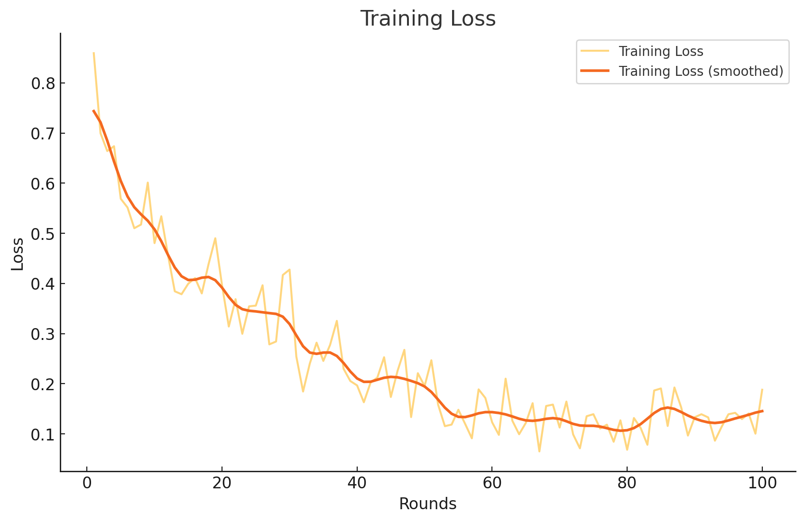

# FlowerTune LLM on General NLP Dataset

This directory conducts federated instruction tuning with a pretrained [NX-AI/xLSTM-7b](https://huggingface.co/NX-AI/xLSTM-7b) model on a [General NLP dataset](https://huggingface.co/datasets/vicgalle/alpaca-gpt4).
We use [Flower Datasets](https://flower.dev/docs/datasets/) to download, partition and preprocess the dataset.
Flower's Simulation Engine is used to simulate the LLM fine-tuning process in federated way,
which allows users to perform the training on a single GPU.


## PEFT Adapter

The fine-tuning results have been submitted as a PEFT adapter and can be accessed here:

[FlowerTune-xLSTM-7b-NLP-PEFT](https://huggingface.co/mrs83/FlowerTune-xLSTM-7b-NLP-PEFT)


## Methodology

This experiment performs federated LLM fine-tuning with [DoRA](https://arxiv.org/abs/2402.09353) using the [🤗PEFT](https://huggingface.co/docs/peft/en/index) library.
The clients' models are aggregated with FedAvg strategy.
This provides a baseline performance for the leaderboard of General NLP challenge.


### NX-AI/xLSTM-7b

For the **NX-AI/xLSTM-7b** model I adopted the following fine-tuning methodology:

- **Precision**: `bf16` for model weights.
- **Quantization**: `4-bit` quantization for reduced memory usage.
- **[DoRA](https://arxiv.org/abs/2402.09353) Configuration**:
  - Rank (r): `16`
  - Alpha: `128`
  - Target Modules:
    - `proj_up`
    - `proj_down`
    - `q_proj`
    - `k_proj`
    - `v_proj`
    - `LinearHeadwiseExpand`
- **Training Configuration**:
  - Batch size: `8`
  - Maximum number of steps: `5`
  - Total number of rounds: `100`
  - Fraction fit per round: `0.25`
- **Learning Rate Scheduler**:
  - Cosine Annealing over rounds, where:
    - Maximum LR: `5e-5`
    - Minimum LR: `1e-6`
  - Constant learning rate scheduler over steps
- **Strategy**: `FedAvg`

### Training Loss Visualization

Below is the training loss plot from the experiment:



This methodology enabled efficient fine-tuning within constrained resources while ensuring competitive performance.

### Evaluation Results (Accuracy)

- **STEM**: 13.67 %
- **Social Sciences**: 17.55 %
- **Humanities**: 14.84 %
- **Average**: 15.35 %

### Communication Budget

60609.38 Megabytes


## Environments setup

Project dependencies are defined in `pyproject.toml`. Install them in an activated Python environment with:

```shell
# Install Python 3.11 with pyenv
pyenv install 3.11.11
pyenv global 3.11.11

# Create and activate the virtualenv
pyenv virtualenv flower
pyenv activate 3.11.11/envs/flower

# Install package dependencies
pip install -e .
```

## Experimental setup

The dataset is divided into 20 partitions in an IID fashion, a partition is assigned to each ClientApp.
We randomly sample a fraction (0.25) of the total nodes to participate in each round, for a total of `100` rounds.
All settings are defined in `pyproject.toml`.

> [!IMPORTANT]
> Please note that `[tool.flwr.app.config.static]` and `options.num-supernodes` under `[tool.flwr.federations.local-simulation]` are not allowed to be modified for fair competition if you plan to participated in the [LLM leaderboard](https://flower.ai/benchmarks/llm-leaderboard).


## Running the challenge

Run the challenge with default config values.
The configs are defined in `[tool.flwr.app.config]` entry of `pyproject.toml`, and are loaded automatically.

```bash
flwr run
```

## Running evaluation

Please check [flowertune_eval](https://github.com/mrs83/FlowerTune-xLSTM-7b-NLP/tree/main/flowertune_eval).

## Model saving

The global PEFT model checkpoints are saved every 5 rounds after aggregation on the sever side as default, which can be specified with `train.save-every-round` under [tool.flwr.app.config] entry in `pyproject.toml`.

> [!NOTE]
> Please provide the last PEFT checkpoint if you plan to participated in the [LLM leaderboard](https://flower.ai/benchmarks/llm-leaderboard).
